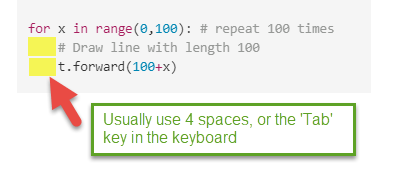
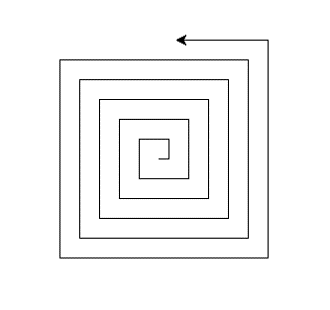

[index](../index.md)

# 02 Drawing with Python Turtle

## 2.0 Introduction

“Turtle” is a fun and easy-to-use feature in Python that acts like a drawing board. Imagine a turtle that you can control with your commands to create amazing drawings on the screen. By telling the turtle where to move and what to draw, you can explore the exciting world of programming while unleashing your creativity!


## 2.1 Drawing lines

The first thing you need to do before using Turtle is to import the Turtle module with this line of code:

``` python
import turtle
```

CCheck more about the [python turtle doc](https://docs.python.org/3/library/turtle.html)


### 2.1.1 Drawing a line with python Turtle

In your Python editor, create a new file and name it as MyFirstTurtle.py

``` python
# Code sample MyFirstTurtle.py
import turtle

# Draw line with length 100
turtle.forward(100)

# After drawing, you can keep the window open by adding the following line. This allows you to view what you have drawn.
turtle.done() 

```

Notice the turtle.done() function, this is used for terminal waiting for user to close the python running window.


### 2.1.2 Make turn and draw another line

please add below code before `turtle.done()` of code in 2.1

```python

# make turn 90 degree and draw another line
turtle.left(90)
turtle.forward(100)

```

### 2.1.3 Continue and draw a square

Repeat the code in 2.2 twice, you could get a square.
Below example, in stand of using `turtle` directly, I chose use a `turtle.Pen()` instance.

``` python
# Code sample MyFirstTurtle.py
import turtle
t = turtle.Pen() # make a turtle Pen instance.

# Draw line with length 100
t.forward(100)

# make turn 90 degree and draw another line
t.left(90)
t.forward(100)

# continue turn and drawing line twice
t.left(90)
t.forward(100)
t.left(90)
t.forward(100)

# not close the window
turtle.done()

```


### 2.1.4 if you make a right turn

Turtle left turn command is `t.right()`.  Please try to drawing lines like below image:


## 2.2 Advanced

### 2.2.1 Make Another turtle

With below code, you could multiple turtles, please try and see how it works

```python
import turtle
t1 = turtle.Pen()
t2 = turtle.Pen()
t1.right(90)
t2.left(90)
t1.forward(100)
t2.forward(100)
#when you click the screen, exit the python
turtle.exitonclick()
```


### 2.2.2 Advance: set up the screen

Advance, set up the screen and turtle

you can setup the background color and title of the window, and create a turtle object


  ```python
  import turtle

  # Create a screen object
  screen = turtle.Screen()

  # Set the background color of the screen
  screen.bgcolor("lightblue")

  # Set the title of the window
  screen.title("My Turtle Drawing")

  # Create a turtle object
  my_turtle = turtle.Turtle()
 
  my_turtle.forward(100)  # Move forward 100 units
  my_turtle.right(90)     # Turn right by 90 degrees

  # Finish the drawing
  turtle.done()
  ```


### 2.2.3 loop repeat 100 times

Try loop in python, draw 100 squares.

  ```python
  # Drawing 100 squares
  import turtle
  t= turtle.Pen()

  for x in range(0,100): # repeat 100 times
      # Draw line with length 100
      t.forward(100+x)

      # make turn 90 degree and draw another line
      t.left(90)
      t.forward(100+x)

      # continue turn and drawing line twice
      t.left(90)
      t.forward(100+x)
      t.left(90)
      t.forward(100+x)
      print(x) # x will be from 0 to 99
      
  #when you click the screen, exit the python
  turtle.exitonclick()
  ```

**Note:** Python using **Indentation** (spaces before line of code) to indicate a block of code.




## 2.3 Practice and challenge

- Try change the code in the 2.1.5 , see if you could draw how many different type of lines pattern.

- Try to modify your code and build below lines of pattern:
   

## Run Turtle on Google Colab

- [Run Turtle on Google colab](https://colab.research.google.com/drive/1rMtJMhenAaLkEF8Af9uP-yJJZ5Updo1e?usp=sharing)

[prev charter](01.GetStartWithPython.md)
[next charter](02.2_Turtle_DrawCycleAndColor.md)