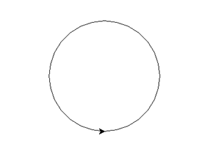
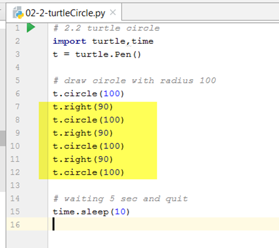
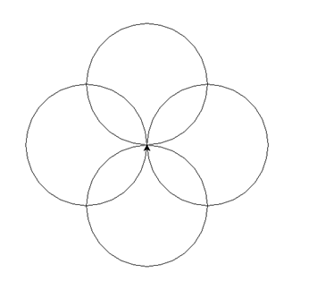
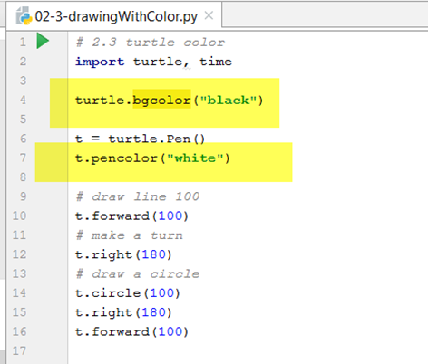
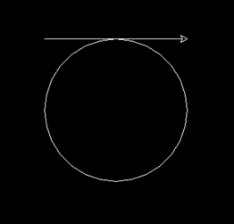
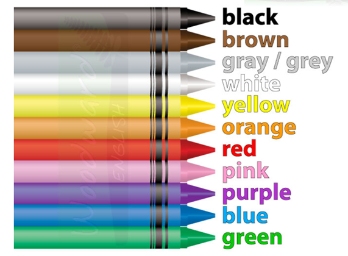
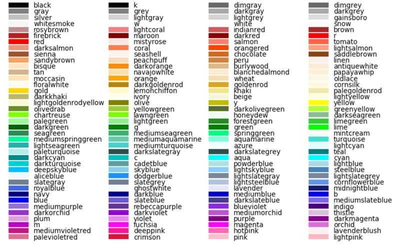
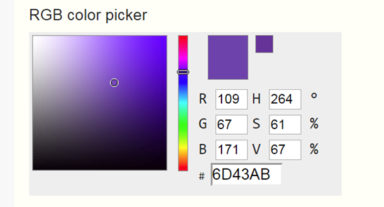

[index](../index.md)
# 02 Drawing with Python Turtle

## 2.2 Drawing Circle and color in Turtle

### 2.2.1 Turtle circle function

Below is a example of draw a circle with Turtle

```python
import turtle,time
t=turtle.Pen()

# draw circle with radius 100
t.circle(100)

#waiting 5 sec and exit python
time.sleep(10)
```

You will got a circle like below



### 2.2.2 Drawing more circles

Below code will draw a 4 circles



please update your code in the 2.2.1 by add the highlight lines, 
you should get image of below:


## 2.3 Color in Turtle

### 2.3.1 Chose a color for your drawing

You could change the background color or the pen color with the code `bgcolor()`  and `pencolor()`



and you will get a result like below:


### 2.3.2 Color you could chose

- Base Color

- There are some basic colors be used a lot:


- if you need more color (css color)


### 2.3.3 Unlimited RGB Color

The [RGB color system](https://www.nixsensor.com/what-is-rgb-color/) is one of the most well-known color systems in the world, and perhaps the most ubiquitous. As an additive color system, it combines **R**ed, **G**reen, and **B**lue light to create the colors we see on our TV screens, computer monitors, and smartphones.

In Python you could use RGB color to draw any color the computer supported.

The example of RGB color string in python is start with "#" and followed with 6 [Hexadecimal number](https://simple.wikipedia.org/wiki/Hexadecimal).

```python
turtle.bgcolor("#6D43AB")
t = turtle.Pen()
t.pencolor("#006600")
```
You could use this tool to pick your RGB color: [RGB Color Picker](https://www.rapidtables.com/web/color/RGB_Color.html).

[](https://www.rapidtables.com/web/color/RGB_Color.html)

### 2.3.4 Try it yourself

Try below code to draw the color pattern
[code:2.3.4](./codes/2.3.4_TryColor.py)
```python
import turtle
t = turtle.Pen()
turtle.bgcolor('black')
colors = ['red','yellow','blue','green']
for x in range(200):
    t.pencolor(colors[x%4])
    t.forward(x)
    t.left(91)
```

[previous](02.DrawingWithPythonTurtle.md)
[nxt](02.4_Turtle_more.md)