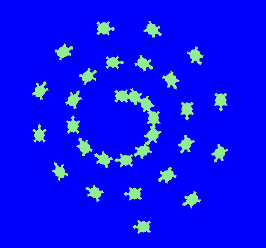

# 02 Drawing with Python Turtle

## 2.4 Learn More About Turtle

There are more function in Turtle you could using when drawing.

`shape()  stamp(), speed(), fillcolor(), goto()`
`penup(), pendown(), hideturtle(), showturtle() `

You could check the turtle docs for more functions we didn't cover:
[Python 3 Turtle documentation](https://docs.python.org/3/library/turtle.html)

### 2.4.1 Turtle Shapes

By default the turtle shape is a arrow, and you could change it to a turtle bye below code:

```python
import turtle,time
t=turtle.Pen()

# change the shape of turtle
t.shape("turtle")

t.forward(100)

time.sleep(10)
```


And you could try below different values for shape:

- "blank"
- "arrow"
- "circle"
- "classic"
- "square"
- "triangle"
- "turtle"

The code example will demo how to show different turtle shapes: code [2.4.1_shape.py](./codes/2.4.1_shape.py)


if you don't want use the default shapes python offered, you could make your own custom shapes.

**Reference read:** [how to create custom turtle shapes in python](https://www.geeksforgeeks.org/how-to-create-custom-turtle-shapes-in-python/)


### 2.4.2 `stamp`,`penup`, `pendown`

`penup()` will let the turtle not drawing trace line,  and `pendown()` will put the pen down and drawing.
`stamp` will make a print of shape in current position.

[code example](./codes/2.4.2_stamp.py)

```python
import turtle,time

turtle.bgcolor("blue")
t = turtle.Turtle() # same as turtle.Pen()
t.shape("turtle")
t.color("lightgreen")

t.penup()
size=15
for i in range(30):
    t.stamp()
    size=size+2
    t.forward(size)
    t.right(30)

time.sleep(10)
```




### 2.4.3 fill color

In python turtle, you could define the color to fill, and tell turtle when to start fill color and when to stop.

code example [2.4.3_fill_color.py](./codes/2.4.3_fill_color.py)

```python
import turtle,time
from turtle import circle

t= turtle.Pen()

t.fillcolor("violet") #define the color to fill
t.begin_fill()   # start to fill color

t.circle(100)
t.right(90)
t.circle(100)

t.end_fill()  # end to fill color

t.right(90)
t.circle(100)
t.right(90)
t.circle(100)

time.sleep(10)
```


### 2.4.4  Position and `goto()`

You alway could use `forward()` to move turtle, and you also could use the position value `(x,y)` to place the turtle.
Keep in mind, you always need use `penup()` to avoid the pen trace in the canvas.

Check the code [2.4.4_goto.py](./codes/2.4.4_goto.py) for example

```python
import turtle,time

#example of draw a Micky mouse

t = turtle.Pen()
t.circle(100)  # draw the center circle

t.penup()
t.goto(100,100) 
t.pendown()
t.circle(70)

t.penup()
t.goto(-100,100)
t.pendown()
t.circle(70)

time.sleep(10)
```


### 2.4.5 project

#### project 1: Star

- Use python turtle to draw a start like below


- hints:
  - Try this on a piece of paper, find how many degree the turtle need turn
  - the sum of total 5 turn rotation degree should be 360.  
  - hide the turtle use `hideturtle()`

#### project 2: Color squares

- Use python turtle do draw 3 squares like below

- hints:
  - use python draw first smallest square without fill color
  - then draw 2nd squares without fill color out the first square, found out the start position and length of square should be, then draw the 3rd squares out side.
  - Fill the color, but you may need reverse the order of drawing
  - find the relationship of change of position and length, find out the pattern.
  - [optional and challenge]if you find out the pattern, you could change to use loop
