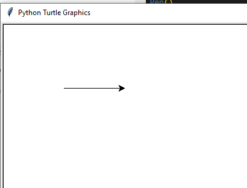
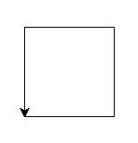
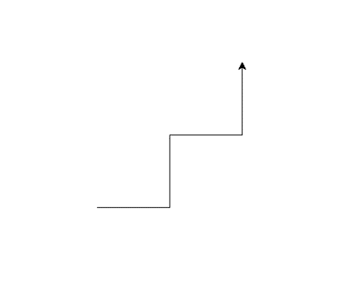
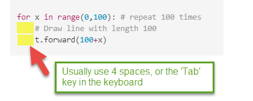
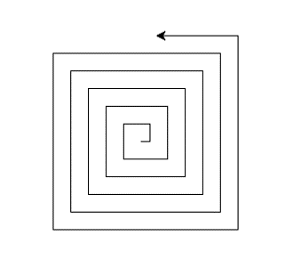

# 02 Drawing with Python Turtle

## 2.1 Drawing lines

“Turtle” is a python feature like a drawing board, which lets you command a turtle to draw all over it

Before you code use turtle you have to import it

``` python
import turtle
```

CCheck more about the [python turtle doc](https://docs.python.org/3/library/turtle.html)


### 2.1.1 Drawing a line with python Turtle

In your Python editor, create a new file and name it as MyFirstTurtle.py

``` python
# Code sample MyFirstTurtle.py
import turtle,time

# Draw line with length 100
turtle.forward(100)

# waiting 10 sec and exit python running window
time.sleep(10)

```

Notice the time.sleep(10) is used for terminal that will close after python script finished. If you use IDLE it will not necessary.



### 2.1.2 Make turn and draw another line

please add below code before `time.sleep()` of code in 2.1

```python

# make turn 90 degree and draw another line
turtle.left(90)
turtle.forward(100)

```

### 2.1.3 Continue and draw a square

Repeat the code in 2.2 twice, you could get a square.
Below example, in stand of using `turtle` directly, I chose use a `turtle.Pen()` instance.

``` python
# Code sample MyFirstTurtle.py
import turtle,time
t = turtle.Pen() # make a turtle Pen instance.

# Draw line with length 100
t.forward(100)

# make turn 90 degree and draw another line
t.left(90)
t.forward(100)

# continue turn and drawing line twice
t.left(90)
t.forward(100)
t.left(90)
t.forward(100)

# waiting 10 sec and exit python running window
time.sleep(10)
```



### 2.1.4 if you make a right turn

Turtle left turn command is `t.right()`.  Please try to drawing lines like below image:



## 2.1.5 Advance, repeat 100 times

Try loop in python, draw 100 squares.

```python
# Drawing 100 squares
import turtle
t= turtle.Pen()

for x in range(0,100): # repeat 100 times
    # Draw line with length 100
    t.forward(100+x)

    # make turn 90 degree and draw another line
    t.left(90)
    t.forward(100+x)

    # continue turn and drawing line twice
    t.left(90)
    t.forward(100+x)
    t.left(90)
    t.forward(100+x)
    print(x) # x will be from 0 to 99
```

**Note:** Python using **Indentation** (spaces before line of code) to indicate a block of code.



2.1.6 Practice and challenge

- Try change the code in the 2.1.5 , see if you could draw how many different type of lines pattern.

- Try to modify your code and build below lines of pattern:
   