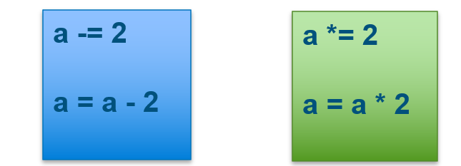

# 3 Number, Variables and Types

## 3.1 Learn Python Variables

### 3.1.1 Let Python do math for you

Math is the basic function of the Python, please try below code and learn the basic operation of "+,-,*, /, %"

```python
x = 3
y = 4
answerPlus = x+y
answerMinus = x-y
answerMultiple = x*y
answerDivide = x/y
answerWhatEver = (x*y)+(x-y)/x
answerMode=x%y

print(x)    #3
print(y)    #4
print(answerPlus)       #7
print(answerMinus)      #-1
print(answerMultiple)   #12
print(answerDivide)     #0.75
print(answerWhatEver)   #11.666666666666666
print(answerMode)       #3

```

### 3.1.2 Assign a Number to a Variable and print it

Use `print()` function you could print the result, but python can't print mix the data type of number and a string.

Below is working

```python
x = 3
print(x)
```

But this is not working:

```python
print("x="+x)
```

You will got error like below:


To correct the type error, you need convert the number to string first.

```python
print("x=" + str(x))
```

### 3.1.3 More Assignment example

Assign a expression to a variable

```python
x = 3
y= x+2
```

example of chain assignment

```python
a = b = x*(y+x)
```

Check the results:

```python
print("a="+ str(a))
print("b="+ str(b))  
```

please try yourself and print the result.

### 3.1.4 Math Operators in Python

There are more math operators you may need, pleas try them and see how it works.


### 3.1.5 practices

- use python get the answer of below express
  3 + 8 × 9 ÷ 7 × ( 5 +6 )

- Update your previous turtle drawing project, using some of math to change the graphic pattern

## 3.2 Type

### 3.2.1 Type of number: Int and float

All variable has a type in python, for example, the string "abc" has a type "String".

The number 1,2,3 is integer number, but 1.23 is fraction number.
In python, the integer number type is `int` the fraction number type is `float`

You could use `type(variable)` to get the type of the variable

```python
number = 9
print (type(number))

float_number = 9.0
print(type(float_number))
```

you will got below type


### 3.2.2 Convert the number type

The type of number could convert each other:

```python
number = 9
f_number= float(number)

print(number)
print(f_fumber)
```

please run it ans see the result yourself.

### 3.2.3 Augmented Assignment

Augmented assignment is the combination, in a single statement, of a binary operation and an assignment statement:



Try below code to see the result

```python
number = 9.0
print("number = " + str(number))

number -= 2
print("number = " + str(number))

number += 5
print("number = " + str(number))
```

## 3.3 Boolean Type and Operators

### 3.3.1 Boolean Type

The Boolean Type only have two value: `true` and `false`

You could compare two value and see the result:

- To check if two variable value is same:

```python
a = 2
b = 3
c = 2
result1 = (a == b)
print(result1)      # false
result2 = (a == c)  # true
print(result2)      # true
```

### 3.3.2 Comparison Operator

There is more operation will got boolean result:


### 3.3.3 Logic Operators

Logic operators are used to combine the two boolean statements:

| Operator | Description | Example |
| ------ | ------ | ------ |
| and   | Return true if both are true | x<4 and x>1 |
| or   | Return True if one of the value is true| x<4 or x>10 |
| not  | reverse the result | not(x>y) |

## 3.4 Practice

- Write a Python program, given a radius value, it compute and area of the circle.
   example:
   r = 1.1
   Area = 3.8013271108436504


- Please use python print all value between 1 and 10, with the condition:
   - x>1 and x<5

## 3.5 More practice (optional and for Advance students )

- practice: Goto the website
<https://www.w3resource.com/python-exercises/python-basic-exercises.php>
Complete the exercises  #4, #10, #38, #48,, #119

- MiniProject
  1. Create a Python project to get the value of Pi to n number of decimal places.
   Note: Input a number and the program will generate PI to the 'nth digit

   [Click me to see the sample solution](https://www.w3resource.com/projects/python/python-projects-1.php)

  2. Create a Python project to guess a number that has randomly selected.

   [Click me to see the sample solution](https://www.w3resource.com/projects/python/python-projects-3.php)