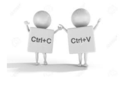
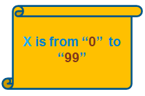
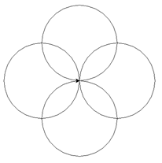
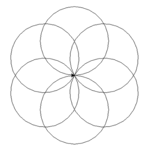
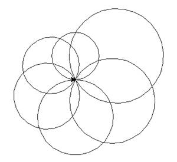
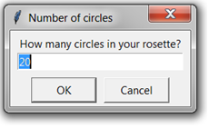
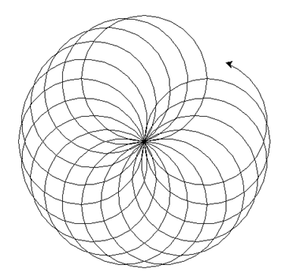

# 4 Loop

## 4.1 What is Loop

when you coding, many times you need repeat to do same or similar things again and again.

You could use copy and paste to repeat the code.


But that's bad code example, because you could you loop and tell computer how many time you need repeat.

## 4.2 For Loop

### 4.2.1 Print "Hello World" 100 times

Below is the example to print "Hello World" 100 time.

```python
for x in range(100):
    print("Hello World!")
```

### 4.2.2 Use the variable in for loop

The variable `x` could be print with `str(x)`.

```python
for x in range(100):
    print("Hello World!" +str(x))
```

In python, the x is start fom 0, and end with 99 in this example



### 4.2.3 Example: Draw 4 Circles

To draw 4 circles like below



Below code will draw the 4 circles:

```python
import turtle

t = turtle.Pen()

for x in range(4):
    t.circle(100)
    t.left(90)

```

### 4.2.4 Practice, draw 6  circles

- Please do it yourself, modify the code in 4.2.3 and change it to draw below 6 circles



- Please try to use the `x` variable to draw 6 circle like below


### 4.2.5 Advance, change variable with User input

Please practice below code, to see how to let user input the value.

```python
import turtle, time
t = turtle.Pen()
t.speed(10)

# Ask the user for the number of circles in their rosette, default to 20
number_of_circles = int(turtle.numinput("Number of circles", "How many circles in your rosette?", 20))

for x in range(number_of_circles):
    t.circle(100)
    t.left(360/number_of_circles)

time.sleep(10)

```





## 4.3 While Loop

..todo