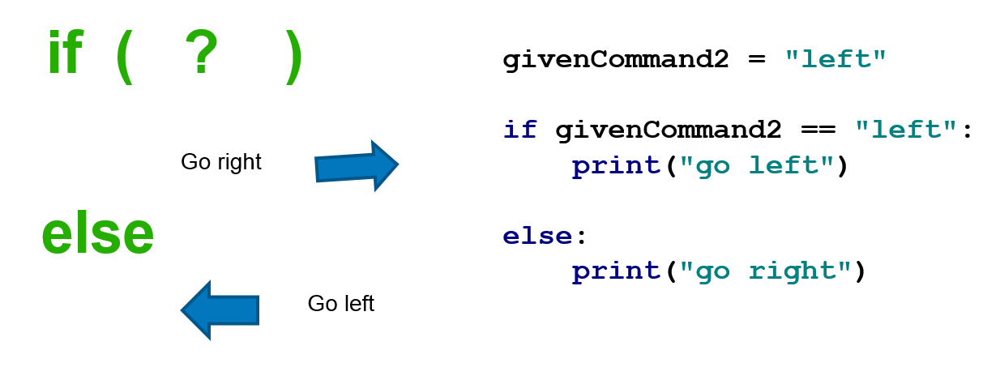
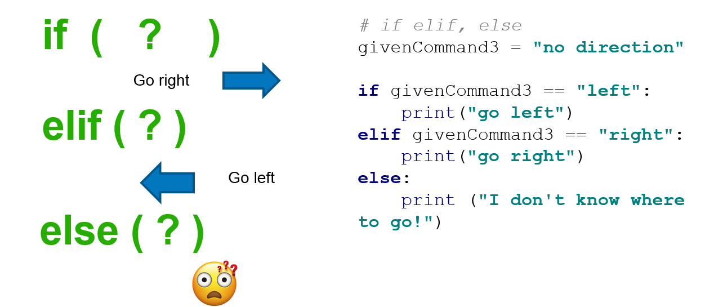
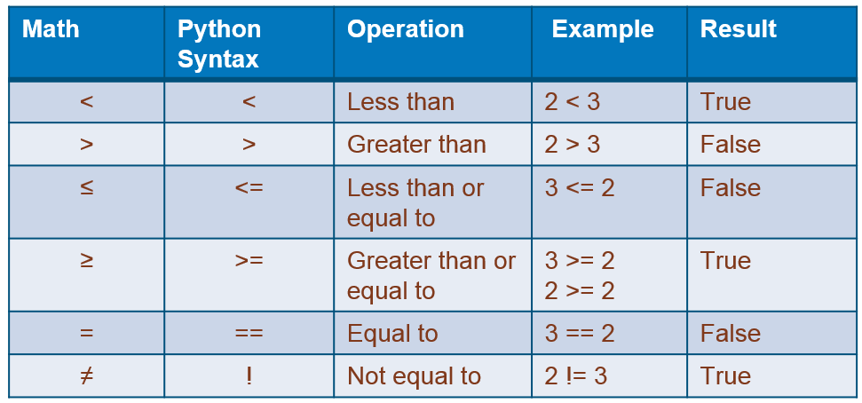
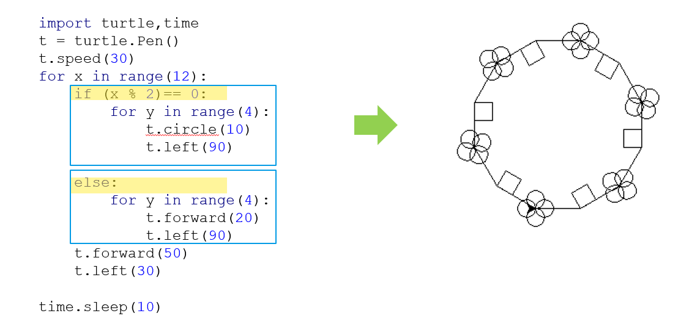
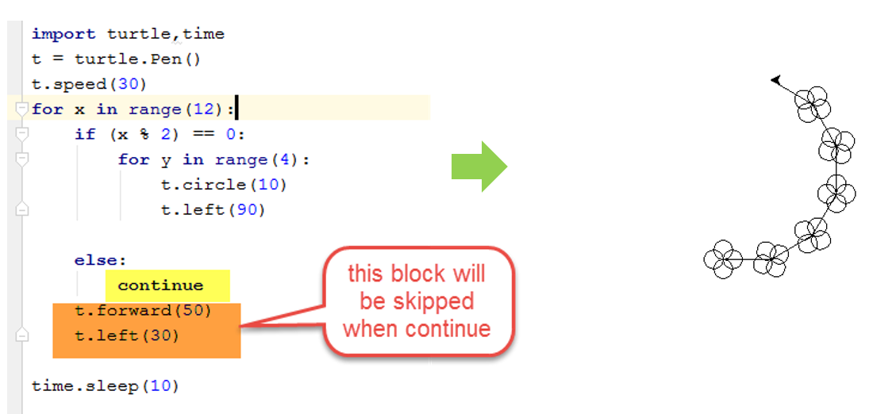
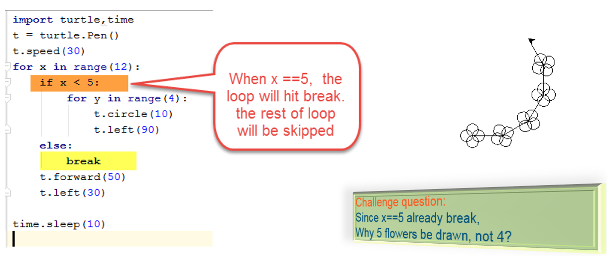
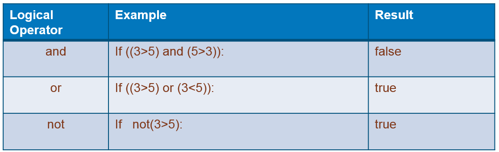
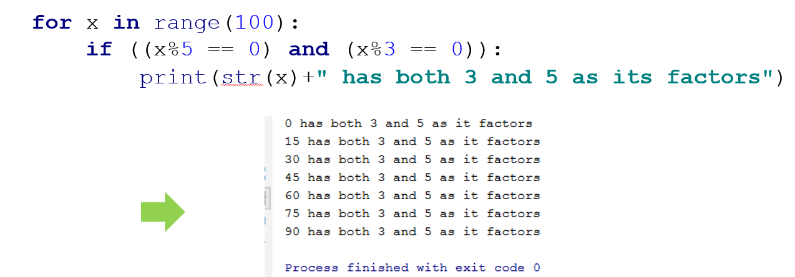
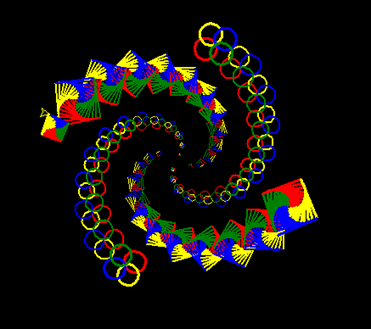

# 05 If and Else

## 5.1 Go Left and Go Right, Make Decision with `if`


`if` key work used with comparison check  like below

```python
            givenCommand = "right"

            if givenCommand == "right":
                print("go right")

            givenCommand = "left"

            if givenCommand == "left":
                print("go left")

```

## 5.2 Use the `else` keyword



## 5.3 Use the `elif` keyword



## 5.4 Practices `if`, `elif`, `else` with your input

Try and give many input with below code:

```python
givenCommand4 = input("Which direction you want to go? y/n:")

if givenCommand4 == "left":
    print("go left")
elif givenCommand4 == "right":
    print("go right")
elif givenCommand4 == "r":
    print("go right")
elif givenCommand4 == "l":
    print("go left")
else:
    print ("I don't know where to go!")

```

## 5.5 Python Comparison Operators



### 5.5.1 practices `> , < , ==` with your input

Try and give some input number with below code:

```python
            myNumber = 5

            yourInput = input("Give a number between 1 to 10?")
            givenNumber = int(yourInput)

            if givenNumber == myNumber:
                print( "equal")
            elif givenNumber > myNumber:
                print("greater")
            elif givenNumber < myNumber:
                print("smaller")
            else:
                print("this will not reached!")
```

### 5.5.2 Practices `>= , <=` with your input

```python
            # WhatsMyGrade.py
            grade = eval(input("Enter your number grade (0-100): "))
            if grade >= 90:
                print("You got an A! :) ")
            elif grade >= 80:
                print("You got a B!")
            elif grade >= 70:
                print("You got a C.")
            elif grade >= 60:
                print("You got a D...")
            else:
                print("You got an F. :( ")
```

## 5.6 Use `if else` in loop

- if even number draw circle, if old number draw square



## 5.7 Use `if else` in the loop with `continue`

- If even number draw circle, else skip rest of code go to next loop



## 5.8 Use `if else` in the loop with `break`

- If even number draw circle, else skip rest of code go to next loop



## 5.9 Complex Conditions with Logic Operators `and, or, not`



- Practice Logic Operators



## 5.10 Challenge

- Change your script from last class by control the color by adding if condition
- Continue modify your script to draw polygons instant of circle when Even number
- Try break when loop reach 500

