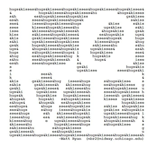

# 06 String & Characters

## 6.1 Python Strings

A **String** is a sequence of characters ( or call symbols)


- String “Python String!” is combination of 15 characters or symbols
- Each Characters/symbols was stored in computer as number
- The most popular numbering system is **ASCII** *(American Standard Code for Information Interchange)*

### 6.1.1 Code to find the ASCII value

The function `ord()` could convert character to ASCII value.

```python
value_P = ord('P')
print("ASCII value of 'P' is ", value_P)
#Upper case 'P' is 80

value_p = ord('p')
print("ASCII value of 'p' is ", value_p)  
#lower case 'p' is 112

```

The function `chr()` could return character from the ASCII value.

### 6.1.2 The ASCII Table

- <https://ascii.cl/>
- <https://www.ascii-code.com/>
- <https://theasciicode.com.ar/>


### 6.1.3 Print ASCII

You could use loop to print ASCII characters

```python
for x in range(20):
    t=""
    for y in range(20):
        t+=(chr(30+x+y))
        print(t)
```


### 6.1.4 Print `String` with Color


```python
print(R+"hello how are you")
print(G+"hello how are you")
```

### 6.1.5 Practice below useful `string` functions

```python
testStr = "Hello World"
#to upper case
print(testStr.upper())
#to lower case
print(testStr.lower())
# get the length
print(len(testStr))
#insert string to another string
print("*".join(testStr))
# use join to reverse a string
print("".join(reversed(testStr)))
# replace a string
print(testStr.replace("o",chr(210)))
#split a string in to array
print(testStr.split(" "))

```

### 6.1.6 DIY, Use Characters to Print ASCII Arts

There is some examples, Please create one yourself




## 6.2 Cipher: Make a secret string

### 6.2.1 Caesar Cipher


### 6.2.2 A example of cipher code of shift code 13

```python
message = input("Enter a message to encode or decode: ") # Get a message
message = message.upper()           # Make it all UPPERCASE :)
output = ""                         # Create an empty string to hold output
for letter in message:              # Loop through each letter of the message
    if letter.isupper():            # If the letter is in the alphabet (A-Z),
        value = ord(letter) + 13    # shift the letter value up by 13,
        letter = chr(value)         # turn the value back into a letter,
        if not letter.isupper():    # and check to see if we shifted too far
            value -= 26             # If we did, wrap it back around Z->A
            letter = chr(value)     # by subtracting 26 from the letter value
    output += letter                # Add the letter to our output string
print("Output message: ", output)   # Output our coded/decoded message

```

## 6.3 String Methods

### 6.3.1 Most user Python String Mehtod

- Get string Length
`len()`

```python
s="a string"
print(len(s))
```

- Change case

```python
s="Hello"
s.lower() # hello
s.upper() # HELLO
```

- Sub String
  
  ```python
  s="Hello"
  s1=s[:2]  # He
  s1=s[0:2] # He
  s2=s[3:]  # lo
  s2=s[3:0] # lo
  s3=s[1:3] # el

  ```

### 6.3.2 Python String Cheat Sheet

<https://www.shortcutfoo.com/app/dojos/python-strings/cheatsheet>

## 6.4 Home work

### 6.4.1 Make you own ASCII Arts 

- print it with the character in ASCII table
- Try to use number chr(n) to print
- Could use the examples in this class
- Charllenges
  - Add color to your ASCII Arts
  - Use array and loop to print your aSCII Arts
  
### 6.4.2 Make your double layer Cipher

Our cipher in the example is easy to cracked, make it harder to guess by double encode.

- Please write script to do the encode
- Please write another script decode your result of first result.


