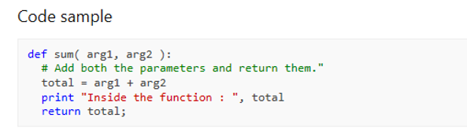
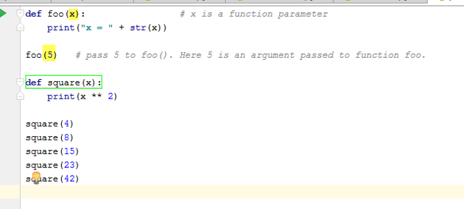
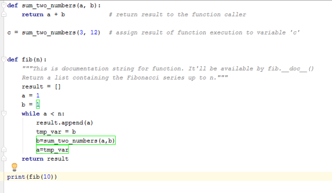

# 07 Functions

## 7.1 Python Functions

A function is a block of **organized**, **reusable** code that is used to perform a single, related action.



### 7.1.1 Define a function

User `def` keyword to define a simple function

```python
def hello_world():
    print("Hello, world!")
```

```python
# call the function Hello_world
hello_world()
```

### 7.1.2 Function with parameters



### 7.1.3 Function return with value



## 7.2 Practice function

### 7.2.1 Write a function return a value

Please write a function with below requirement

- when give a number, it will return a number which is sum of 1 to the input number
- Ex. Input 5,  the return will be 1+2+3+4+5 =15

hint:

```python
result=0
for x in range(5):
    v=x+1
    result=result+v
```

### 7.2.2 Function call another functions

- give a number N bigger than 10
- the function will return the result of  ((1)+(1*2)+(1*2*3)….(1*2*3*4…*N))
- hint, you may need write two functions, one handle (1+2+3+ ... +N)  and another one handle (1*2*3*...*N)
  
### 7.2.3 Recursion function

Do not use for loop, and make the function to get result same as 7.2.1

- A recursion function will call it self
- There will be a condition to return the value stop the loop.

```python
#define recursion function addmore
def addMore(n,max):
    if(n==max):
        result= n
    else:
        result=n+addMore(n+1,max)
    
    print ("n=",str(n)," result=",str(result))
    return result

#end function addMore
r=addMore(1,100)
print(r)

```
