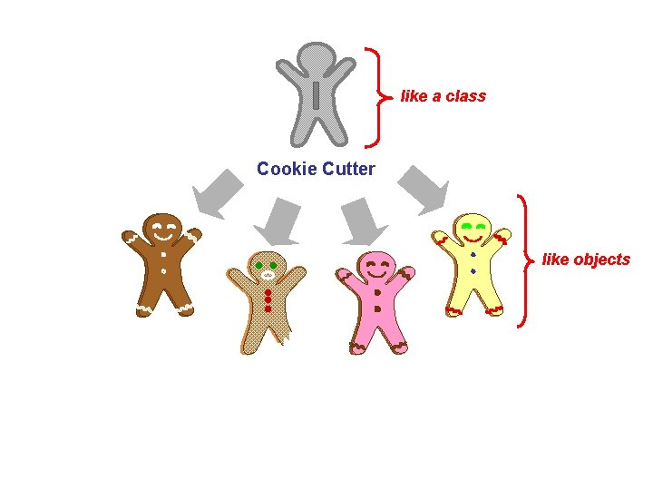

# 08 Python Objects and Classes

View this course from Google colab <https://colab.research.google.com/drive/1RGPuMl6MEUp4uHjKP23G272ogYrygodQ?usp=sharing>

A class is a user-defined blueprint or prototype from which objects are created.



Another example: <https://upload.wikimedia.org/wikipedia/commons/thumb/7/75/CPT-Class-Object-Modification.svg/1200px-CPT-Class-Object-Modification.svg.png>

## 8.1 Create a Class and Object

See the example below of defining a class and then creating an object with the class.

```python
# Define a Class
class MyClass:
    x = 5

# Create an Object with the Class
p1 = MyClass()

# Use the Object
print(p1.x)
```

## 8.2 Create Object with Init

A Python class can have a constructor function for initializing the class.

### 8.2.1 Create Object with Initialized Value

A simple class with an init function.
Notice in the class, the function needs to pass 'self' as its first parameter.

```python
class MyClass:
    def __init__(self):
        self.name = "unknown"

p1 = MyClass()

print(p1.name)
```

**Note**: The `__init__()` function is called automatically every time the class is used to create a new object.

### 8.2.2 The self Parameter

It is just the name of the first parameter, and in the object of the class, the first parameter of the method is always the object itself. You could name it anything.

```python
class MyClass:
    def __init__(me):
        me.name = "test"

p1 = MyClass()

print(p1.name)
```

```python
class MyClass:
    def __init__(this):
        this.name = "test"

p1 = MyClass()

print(p1.name)
```

**Note**:
_In many other languages, you don't need to pass self; they use the keyword 'this' to refer to the object itself._

### 8.2.3 Initialize Object with Passed Values

Create a class to take name and value in init.

```python
class MyClass:
    def __init__(self, name, value):
        self.name = name
        self.value = value

p1 = MyClass("x", 100)
p2 = MyClass("y", 20)

print(p1.name + " = " + str(p1.value))
print(p2.name + " = " + str(p2.value))
```

### 8.2.4 Initialize Object with Variable Length Arguments

If you want, you could create a new object with a flexible number of arguments. Below is an example:

```python
# myClass.py
class MyClass:
    x = 0
    y = 0
    def __init__(self, *args):
        if len(args) > 0:
            self.x = args[0]
        if len(args) > 1:
            self.y = args[1]
    def sum(self):
        return self.x + self.y

# Create an Object with the Class
p1 = MyClass()
print(p1.sum())
p1 = MyClass(2)
print(p1.sum())
p1 = MyClass(2, 3)
print(p1.sum())
```

## 8.3 Methods in Class

Objects can also contain methods. Methods in objects are functions that belong to the object.

Let us create a method in the Person class:

```python
class Person:
    def __init__(self, name, age):
        self.name = name
        self.age = age

    def myfunc(self):
        print("Hello, my name is " + self.name)

p1 = Person("John", 36)
p1.myfunc()
```

## 8.4 Object Properties

The properties of an object are changeable after assignment.

```python
class Person:
    def __init__(self, name, age):
        self.name = name
        self.age = age

    def myfunc(self):
        print("Hello, my name is " + self.name)

p1 = Person("John", 36)
p1.myfunc()

p1.name = "Smith"
p1.age = 24
p1.myfunc()
print("age = " + str(p1.age))
```

**Note**
*Python is a weakly-typed language; you can always create and modify properties at any time.*

```python
p1.name = "Smith"
p1.age = 24
p1.myfunc()
print("age = " + str(p1.age))

p1.age = "twenty-one"
print("age = " + p1.age)
```

## 8.5 Import Python Class from Another File

Save the Person class to person.py

```python
# person.py
class Person:
    def __init__(self, name, age):
        self.name = name
        self.age = age

    def myfunc(self):
        print("Hello, my name is " + self.name)
```

In the same folder, create a Python file with the code below:

```python
from person import Person

p1 = Person("John", 36)
p1.myfunc()
```

If you put your class in a subfolder /myclass/person.py, the import will be:

```python
from myclass.person import Person
```

**Note**
Your class name and directory name should avoid Python keywords.
<https://www.w3schools.com/python/python_ref_keywords.asp>

## 8.6 Practice and Homework

1. Please read below and complete the exercises at the end.
   <https://www.w3schools.com/python/python_classes.asp>

2. Please check your previous code and try to rewrite some of them into one or more classes. You could try to save each class as one file. Then use a main Python file to import them and run the functions in those classes.


