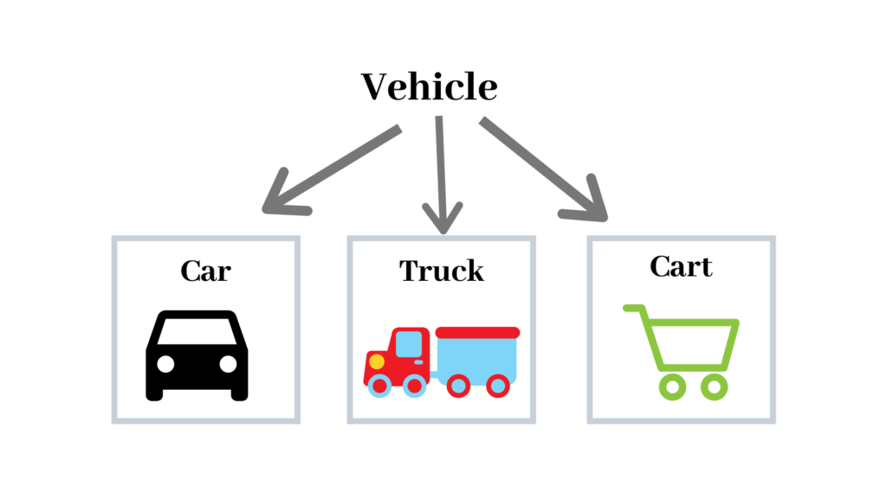
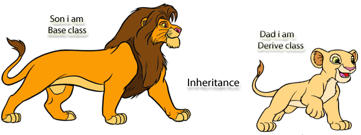
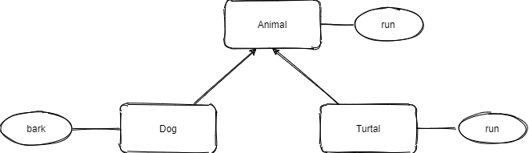

# 09 Python OOP

Object Oriented programming (OOP) is a method of structuring a program by bundling related properties and behaviors into individual objects.

## 9.1 4 principles of OOP

There are 4 major principles that make an language Object Oriented. These are Encapsulation, Data Abstraction, Polymorphism and Inheritance. These are also called as four pillars of Object Oriented Programming.


### 9.1.1 Encapsulation

Encapsulation is achieved when each object keeps its state private, inside a class. Other objects don’t have direct access to this state. Instead, they can only call a list of public functions — called methods.


### 9.1.2 Abstraction

- **Data Abstraction** is a way of creating a simple model of a more complex real-world entities, which contains the only important properties from the perspective of the context of an application. 


- **OOP Abstraction** is using abstract class/Interface we express the intent of the class rather than the actual implementation.



<https://learntocodetogether.com/what-the-heck-is-oop/>

### 9.1.4 Inheritance

In OOP, the child class could reuse all method of parents class.(Except the private members in some advance language).

All child `is a` type of parents.
for example, car is type of vehicle, bird is type of animal, chicken is type of bird, etc.




### 9.1.3 Polymorphism

Polymorphism is mean each child class could have different behaver through inheritance same method from parents.


```python
class Animal(object):
    def __init__(self, name):
        self.name = name

    def talk(self):
        raise NotImplementedError


class Dog(Animal):
    def talk(self):
        return "Bow...Bow..."


class Cat(Animal):
    def talk(self):
        return "Meow...Meow..."


class Human(Animal):
    def talk(self):
        return "I can talk more...."
```

## 9.2 Example of OOP in Python

### 9.2.1 Animal example 1

Below example  show the Animal dog, and turtle class in OOP.



```python
class Animal:

    def __init__(self, name):
        self.name = name 
        print(self.name + " was adopted.")

    def run(self):
        print("running!")

class Dog(Animal):

    def __init__(self, name):
        self.name = name 
        print(self.name + " was adopted.")

    def bark(self):
        print("woof!")

class Turtle(Animal):

    def __init__(self):
        super().init 

    def run(self):
        print("running slowly!")

# we don't care how it works just bark
spot = Dog("spot") #=> spot was adopted. 
spot.bark() #=> woof! 

# Dog inheritance the run method from animal
spot.run() #=> running! 

# we get back an interesting response 
tim = Turtle("tim") #=> tim was adopted. 
tim.run() #=> running slowly!

```

### 9.2.2 Animal example 2

Below show more complex example of Inheritance and Polymorphism.


```python
class Animal:
    def __init__(self,name,gender):
        self.name=name
        self.gender=gender
    def __str__(self) -> str:
        return "class={}: name:{} gender:{}".format(type(self).__name__,self.name,self.gender)

class Bird(Animal):
    def __init__(self,name,gender):
        Animal.__init__(self,name,gender)
    def flying(self):
        return "birds flying..."  

class Chicken(Bird):
    def __init__(self,name,gender):
        super().__init__(name,gender) #python 3 and upper you could use supper() to init parent without self
        self.gender=gender
    def flying(self):
        return "chicken {} can't fly..".format(self.name)

class CanadianGoose(Bird):
    def __init__(self,name,gender):
        Bird.__init__(self,name,gender)
    def swimming(self):
        return "Canadian Goose floating on the water.."

aHen = Chicken("egg hatcher","F")
aRooster = Chicken("big Foot","M")
aGoose = CanadianGoose("wild goose","unknown") 

print(aHen.flying())
print(aGoose.flying())
print(aGoose.swimming())
print(aRooster)

```

## 9.3 Home work

Please practice the OOP by write class `vehicle, Car, truck`.

## 9.4 Reference

Read more if you need  understand more of the OOP for python

- <https://www.w3schools.com/python/python_inheritance.asp>
- <https://realpython.com/python3-object-oriented-programming/>
- <https://learnbatta.com/course/python/python-object-oriented-programming/>
- <https://medium.com/@cancerian0684/what-are-four-basic-principles-of-object-oriented-programming-645af8b43727>
- <https://dev.to/terrythreatt/the-four-principles-of-object-oriented-programming-in-python-1jbi>