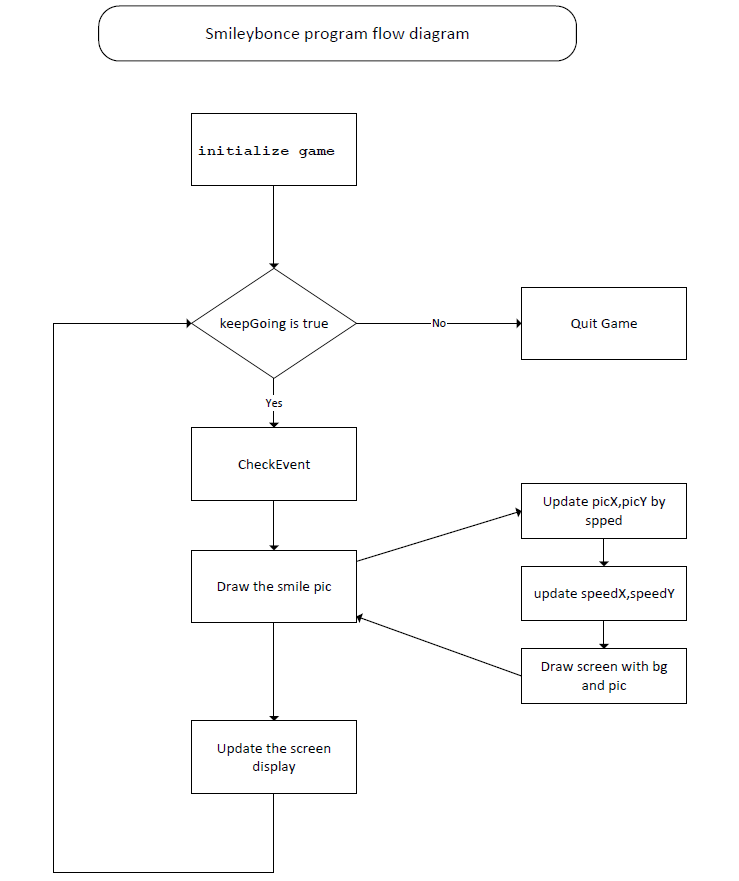
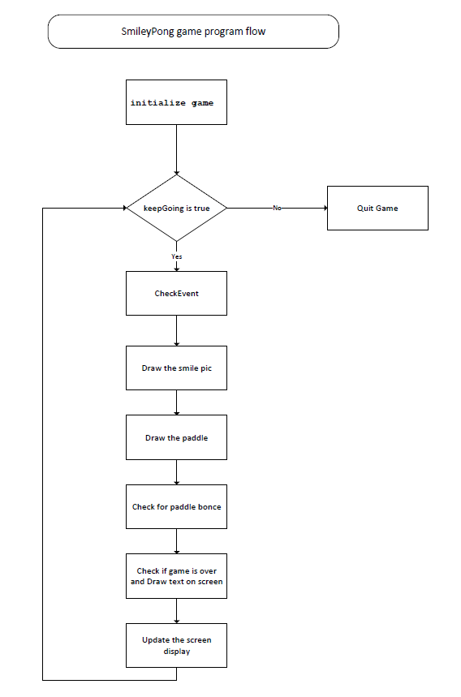

# 11 Learn PyGame -2

Source code of this Chapter [code](./codes/11.python_smileyPong/)

## 11.2 Smiley bonce program



```python
import pygame        
# Setup
pygame.init()
screen = pygame.display.set_mode([800,600])
keep_going = True
pic = pygame.image.load("CrazySmile.bmp")
colorkey = pic.get_at((0,0))  
pic.set_colorkey(colorkey) #Set the transparent colorkey
picx = 0
picy = 0
BLACK = (0,0,0)
timer = pygame.time.Clock()
speedx = 5
speedy = 5

# Game loop
while keep_going:    
    for event in pygame.event.get(): 
        if event.type == pygame.QUIT: 
            keep_going = False
    picx += speedx
    picy += speedy
    
    if picx <= 0 or picx + pic.get_width() >= 800:
        speedx = -speedx
    if picy <= 0 or picy + pic.get_height() >= 600:
        speedy = -speedy
    screen.fill(BLACK)    
    screen.blit(pic, (picx, picy))  #draw the picture on the screen
    pygame.display.update()
    timer.tick(60)  # wait 60ms, https://www.pygame.org/docs/ref/time.html

# Exit    
pygame.quit()        
```

## 11.3 SmileyPong Game




```python
import pygame    

# 1.initialize game
pygame.init()
screen = pygame.display.set_mode([800,600])
pygame.display.set_caption("Smiley Pong")
keepGoing = True
pic = pygame.image.load("CrazySmile.bmp")
colorkey = pic.get_at((0,0))
pic.set_colorkey(colorkey)
picx = 0
picy = 0
BLACK = (0,0,0)
WHITE = (255,255,255)
timer = pygame.time.Clock()  # https://www.pygame.org/docs/ref/time.html#pygame.time.Clock
speedx = 5
speedy = 5
paddlew = 200
paddleh = 25
paddlex = 300
paddley = 550
picw = 100
pich = 100
points = 0
lives = 5
font = pygame.font.SysFont("Times", 24)

# 2. running game
while keepGoing:    # Game loop
    #2.1 check if game quit
    for event in pygame.event.get():
        if event.type == pygame.QUIT: 
            keepGoing = False
        if event.type == pygame.KEYDOWN:
            if event.key == pygame.K_F1:    # F1 = New Game
                points = 0
                lives = 5
                picx = 0
                picy = 0
                speedx = 5
                speedy = 5
            
    #2.2 draw the smile pic
    picx += speedx
    picy += speedy
    
    if picx <= 0 or picx >= 700:
        speedx = -speedx * 1.1
    if picy <= 0:
        speedy = -speedy + 1
    if picy >= 500:
        lives -= 1
        speedy = -5
        speedx = 5
        picy = 499
    screen.fill(BLACK)       # clean the background
    screen.blit(pic, (picx, picy))  # draw the pic to the position.

    # 2.3 Draw paddle
    paddlex = pygame.mouse.get_pos()[0]
    paddlex -= paddlew/2
    pygame.draw.rect(screen, WHITE, (paddlex, paddley, paddlew, paddleh))

    # 2.4 Check for paddle bounce
    if picy + pich >= paddley and picy + pich <= paddley + paddleh \
       and speedy > 0:
        if picx + picw/2 >= paddlex and picx + picw/2 <= paddlex + \
           paddlew:
            speedy = -speedy
            points += 1

    # 2.5 Check whether the game is over, and Draw text on screen
    draw_string = "Lives: " + str(lives) + " Points: " + str(points)
    if lives < 1:   
        speedx = speedy = 0
        draw_string = "Game Over. Your score was: " + str(points)
        draw_string += ". Press F1 to play again. "
        
    text = font.render(draw_string, True, WHITE)
    text_rect = text.get_rect()
    text_rect.centerx = screen.get_rect().centerx
    text_rect.y = 10
    screen.blit(text, text_rect)

    # 2.6  update the screen display
    pygame.display.update()
    timer.tick(60) # update the clock,  the program will never run at more than 60 frames per second
    
# 3.quit game
pygame.quit()       # Exit
```

## 11.4 Load Sound with Game

```python
pygame.mixer.init() # add sounds
blip = pygame.mixer.Sound("blip.wav")
blap = pygame.mixer.Sound("blap.wav")
```

```python
    # check for paddle bounce
    if picy + pich >= paddley and picy + pich <= paddley + paddleh  and speedy > 0:
        if picx + picw/2 >= paddlex and picx + picw/2 <= paddlex + paddlew:
            speedy = -speedy
            points += 1
            blip.play()
```

## 11.5 Online PyGame Tutorial and videos

- **Pygame in 90 Minutes - For Beginners**
  - Source: <https://github.com/techwithtim/PygameForBeginners>
  - Tutorial: <https://www.youtube.com/watch?v=jO6qQDNa2UY>

- **Space Invader : Pygame Tutorial for Beginners**
  - Source code: <https://github.com/attreyabhatt/Space-Invaders-Pygame>
  - Tutorial video <https://www.youtube.com/watch?v=FfWpgLFMI7w>

- **Learning pygame by making Flappy Bird**
  - Tutorial Video: <https://www.youtube.com/watch?v=UZg49z76cLw>
  - Project files: <https://github.com/clear-code-projects/FlappyBird_Python>
  - Image files: <https://github.com/samuelcust/flappy-bird-assets>
  - Sounds resources: <https://www.sounds-resource.com/mobile/flappybird/sound/5309/>

- **Learning pygame by creating Snake**
  - Video: <https://www.youtube.com/watch?v=QFvqStqPCRU>
  - Source Code: <https://github.com/clear-code-projects/Snake>
  
- **How to build SNAKE in Python**
  - Source code: <https://github.com/kiteco/python-youtube-code/tree/master/snake>
  - Video: <https://www.youtube.com/watch?v=9bBgyOkoBQ0>
  
- **PyGame Platformer Game Beginner**
  - Video: <https://www.youtube.com/watch?v=Ongc4EVqRjo>
  - Source Code: <https://github.com/russs123/Platformer>
  - Sounds: <https://freesound.org/>
  - Sprites: <https://kenney.nl/assets/platformer-art-deluxe>
  