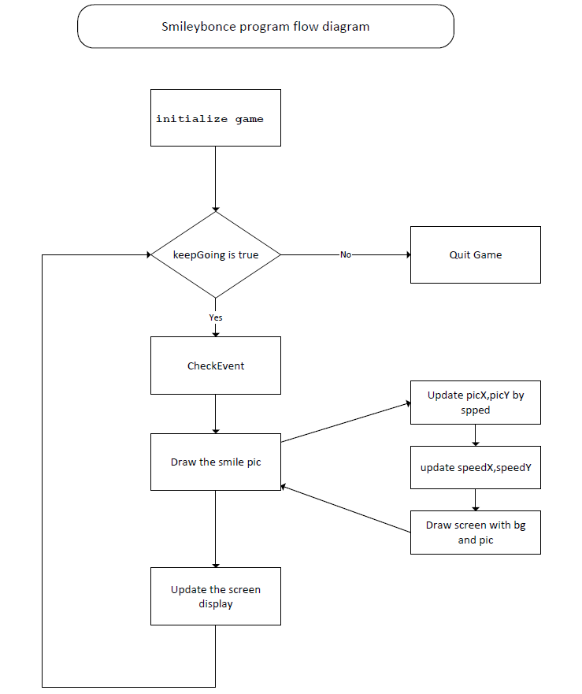
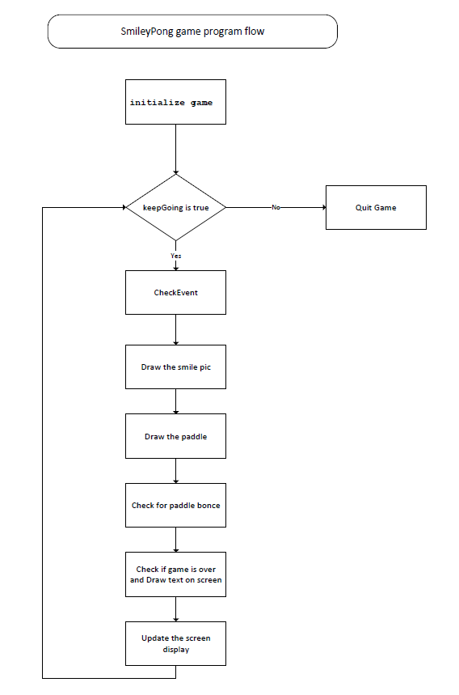

# 10.2 Learn PyGame -2

Source code of this Chapter 

[happy face code 1](./codes/10.python_smileyPong/happyface.py)
[Happy Face Code 2](./codes/10.python_smileyPong/happyface1.py)

## 10.2.1 Smiley bonce program



```python
import pygame  

# 1 initial game
pygame.init()
screen = pygame.display.set_mode([800,600])
pygame.display.set_caption("Happy Face")
keep_going = True
pic = pygame.image.load("happyface.png")
color_key = pic.get_at((0,0))  
pic.set_colorkey(color_key) #Set the transparent colorkey
pic_x = 0
pic_y = 0
BLACK = (0,0,0)
WHITE = (255,255,255)
timer = pygame.time.Clock()
speed_x = 5
speed_y = 5

pic_w = pic.get_width()
pic_h = pic.get_height()

points = 0
lives = 5
font = pygame.font.SysFont("Times", 24)


#2 Game loop if keep_going is true
while keep_going:   
    # 3 check event
    for event in pygame.event.get(): 
        if event.type == pygame.QUIT: 
            keep_going = False
        
    #4 update pic position  
    # 4.1 update pic x,y with speed         
    pic_x += speed_x
    pic_y += speed_y
    
    # 4.2 check the bouncing 
    if pic_x <= 0 or (pic_x + pic_w) >= 800:
        speed_x = -speed_x
        print("pic_x+pic_w>800: "+str(pic_x + pic_w))
    if pic_y <= 0 or (pic_y + pic_h) >= 600:
        speed_y = -speed_y
        print("pic_y+pic_h>600: "+str(pic_y + pic_h))
     
    # 4.3 check the
    screen.fill(BLACK)    
    screen.blit(pic, (pic_x, pic_y))  #draw the picture on the screen    
    
    # 5 Update Display   
    pygame.display.update()
    timer.tick(60)  # howmany frame every sec, https://www.pygame.org/docs/ref/time.html

# Quite/Exit Game    
pygame.quit()      
```

## 11.2.2 SmileyPong Game

2

```python
import pygame  

pygame.init()
screen = pygame.display.set_mode([800,600])
pygame.display.set_caption("Happy Face")
keep_going = True
pic = pygame.image.load("happyface.png")
color_key = pic.get_at((0,0))  
pic.set_colorkey(color_key) #Set the transparent colorkey
pic_x = 0
pic_y = 0
BLACK = (0,0,0)
WHITE = (255,255,255)
timer = pygame.time.Clock()
speed_x = 5
speed_y = 5

pic_w = pic.get_width()
pic_h = pic.get_height()

points = 0
lives = 5
font = pygame.font.SysFont("Times", 24)

# define paddle size and location
paddle_w = 200
paddle_h = 25
paddle_x = 300
paddle_y = 550


while keep_going:    
    for event in pygame.event.get(): 
        if event.type == pygame.QUIT: 
            keep_going = False
        # Add event when you click F5 to restrat game
        if event.type == pygame.KEYDOWN:
                if event.key == pygame.K_F1:    # F1 = New Game
                    points = 0
                    lives = 5
                    pic_x = 0
                    pic_y = 0
                    speed_x = 5
                    speed_y = 5  
                
    pic_x += speed_x
    pic_y += speed_y
    
    # Update the logic to handle the bounce
    if pic_x <= 0 or pic_x >= 700:
        speed_x = -speed_x * 1.1
    if pic_y <= 0:
        speed_y = -speed_y + 1
    if pic_y >= 500:
        lives -= 1
        speed_y = -5
        speed_x = 5
        pic_y = 499
        
   
    
    screen.fill(BLACK)    
    screen.blit(pic, (pic_x, pic_y))  #draw the picture on the screen
    
    
    # Draw paddle
    paddle_x = pygame.mouse.get_pos()[0]
    paddle_x -= paddle_w/2
    pygame.draw.rect(screen, WHITE, (paddle_x, paddle_y, paddle_w, paddle_h))
    
    # Check for paddle bounce
    if pic_y + pic_h >= paddle_y and pic_y + pic_h <= paddle_y + paddle_h \
       and speed_y > 0:
        if pic_x + pic_w/2 >= paddle_x and pic_x + pic_w/2 <= paddle_x + \
           paddle_w:
            speed_y = -speed_y
            points += 1

    # Check whether the game is over, and Draw text on screen
    draw_string = "Lives: " + str(lives) + " Points: " + str(points)
    if lives < 1:   
        speed_x = speed_y = 0
        draw_string = "Game Over. Your score was: " + str(points)
        draw_string += ". Press F1 to play again. "
        
    text = font.render(draw_string, True, WHITE)
    text_rect = text.get_rect()
    text_rect.centerx = screen.get_rect().centerx
    text_rect.y = 10
    screen.blit(text, text_rect)
       
    pygame.display.update()
    timer.tick(60)  # how many frames every sec, https://www.pygame.org/docs/ref/time.html

# Exit    
pygame.quit() 
```

## 11.4 Load Sound with Game

```python
pygame.mixer.init() # add sounds
blip = pygame.mixer.Sound("blip.wav")
blap = pygame.mixer.Sound("blap.wav")
```

```python
    # check for paddle bounce
    if picy + pich >= paddley and picy + pich <= paddley + paddleh  and speedy > 0:
        if picx + picw/2 >= paddlex and picx + picw/2 <= paddlex + paddlew:
            speedy = -speedy
            points += 1
            blip.play()
```

## 11.5 Online PyGame Tutorial and videos

- **Pygame in 90 Minutes - For Beginners**
  - Source: <https://github.com/techwithtim/PygameForBeginners>
  - Tutorial: <https://www.youtube.com/watch?v=jO6qQDNa2UY>

- **Space Invader : Pygame Tutorial for Beginners**
  - Source code: <https://github.com/attreyabhatt/Space-Invaders-Pygame>
  - Tutorial video <https://www.youtube.com/watch?v=FfWpgLFMI7w>

- **Learning pygame by making Flappy Bird**
  - Tutorial Video: <https://www.youtube.com/watch?v=UZg49z76cLw>
  - Project files: <https://github.com/clear-code-projects/FlappyBird_Python>
  - Image files: <https://github.com/samuelcust/flappy-bird-assets>
  - Sounds resources: <https://www.sounds-resource.com/mobile/flappybird/sound/5309/>

- **Learning pygame by creating Snake**
  - Video: <https://www.youtube.com/watch?v=QFvqStqPCRU>
  - Source Code: <https://github.com/clear-code-projects/Snake>
  
- **How to build SNAKE in Python**
  - Source code: <https://github.com/kiteco/python-youtube-code/tree/master/snake>
  - Video: <https://www.youtube.com/watch?v=9bBgyOkoBQ0>
  
- **PyGame Platformer Game Beginner**
  - Video: <https://www.youtube.com/watch?v=Ongc4EVqRjo>
  - Source Code: <https://github.com/russs123/Platformer>
  - Sounds: <https://freesound.org/>
  - Sprites: <https://kenney.nl/assets/platformer-art-deluxe>
  