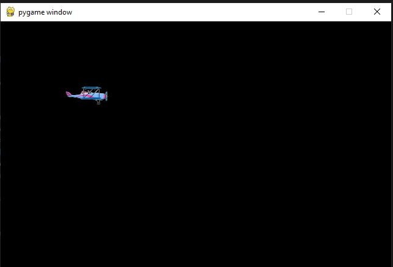
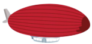
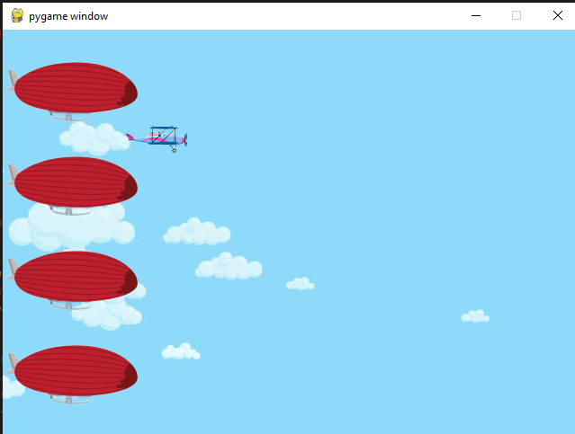
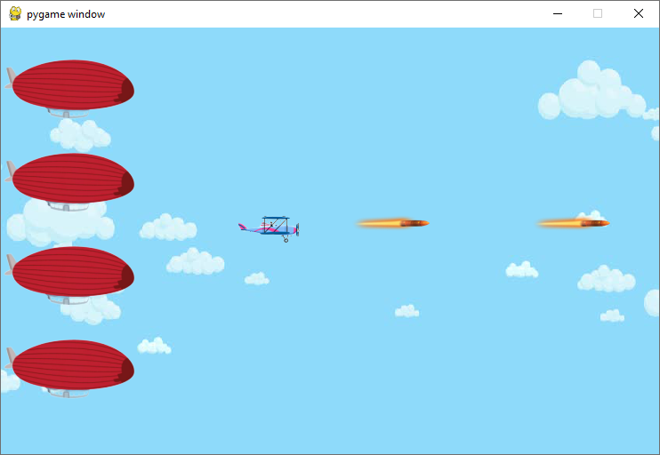

# 10.3 Build a AirForce Game step by step (Part 1)

## 10.3.1 Step1 Initial the PYGame

- Create a project folder, and add a images folder in the project folder
`\yourProject\`
`\yourProject\images\`

- Prepare a image for the player of your game:


**Hint:** *You could use the <https://www.remove.bg/> to remove background of your images for game*

- Create a py file with below code

```python
# step 1, init the game and load image

# 1.1 - Import library
import pygame

# 1.2 - Initialize the game 
pygame.init()
width, height = 640, 480
screen=pygame.display.set_mode((width, height))
keep_going = True

# 1.3 - Load images
player = pygame.image.load("images/player.png")

# 1.4 - use loop to keep the game running 
while keep_going:
    # 1.5 - clear the screen before drawing it again
    screen.fill(0)
    #1.6 - draw the screen elements
    screen.blit(player, (100,100))
    #1.7 - update the screen
    pygame.display.flip() # will update the contents of the entire display, and faster than .update()
    # 1.8 - loop through the events
    for event in pygame.event.get():
        # check if the event is the X button
        if event.type==pygame.QUIT:
            keep_going = False
            

#1.9 exit pygame and python
pygame.quit()
exit(0) 
```


[Source Code of Step1](codes/PyGameSteps/step1.py)

## 10.3.2 Step 2: Load background and additional objects

- Prepare images of a background
  `background = pygame.image.load("images/sky.jpg")`

  There are different ways to load background,
  1. you could use one big image
  `screen.blit(background,(0,0))`
  
  2. you could change your statch your image to fit the screen size
    `background = pygame.transform.scale(background, (width, height))`

  3. if you image is small, you need use double loop to fill the background

  ```python
    for x in range( int(width/background.get_width())+1):
        for y in range(int(height/background.get_height())+1):
            screen.blit(background,(x*100,y*100))
  ```
  
  

- Prepare a air balloon as cargo you need protect
   - `cargo = pygame.image.load("images/airballoon.png")`
  

  - Load multiple cargo
  ```python
    screen.blit(cargo,(0,30))
    screen.blit(cargo,(0,135))
    screen.blit(cargo,(0,240))
    screen.blit(cargo,(0,345))
  ```
  - do yourself: use `list` and loop to load air balloon

  ```python
  ##initial
  balloons=[]
  for(i in range(4)):
      balloons.append([0,(30+i*100)])
  # in run loop
  for(balloonPos in balloons):
     screen.blit(cargo,balloonPos) 
  ```

 - The full code example
  
```python
#Step2, Load background and cargo
import pygame

pygame.init()
width, height = 640, 480
screen=pygame.display.set_mode((width, height))
keep_going = True


player = pygame.image.load("images/player.png")

#---------------------------------------------
#2.1 load more images
background = pygame.image.load("images/sky.jpg")
cargo = pygame.image.load("images/airballoon.png")
#---------------------------------------------

while keep_going:

    screen.fill(0)
    
    #----------------------------------------
    #2.2 load the background
    screen.blit(background,(0,0))
    # if you image is small, you need use double loop to fill the background
    #for x in range( int(width/background.get_width())+1):
    #    for y in range(int(height/background.get_height())+1):
    #        screen.blit(background,(x*100,y*100))
    
    # 2.3 load the balloon cargo
    screen.blit(cargo,(0,30))
    screen.blit(cargo,(0,135))
    screen.blit(cargo,(0,240))
    screen.blit(cargo,(0,345))
    #----------------------------------------

    screen.blit(player, (130,100))
    
    pygame.display.flip() 
    
    for event in pygame.event.get():
        if event.type==pygame.QUIT:
            keep_going = False

pygame.quit()
exit(0)
```
[SourceCode of Step 2](codes/PyGameSteps/step2.py)



## 10.3.3 Step 3: Make the player moving with AWSD key press


- 3.1 initial the value of Key and position

```python

key_up=key_down=key_left=key_right = False
player_pos=[130,100]
```

- 3.2 in running loop, set the player position
  
  `screen.blit(player, player_pos)`

- 3.3 the Event driven code use the pygame.KEYDOWN
  
  ```python
  #3.3 monitor the key down and up
    for event in pygame.event.get():
        if event.type==pygame.QUIT:
            keep_going = False
        if event.type == pygame.KEYDOWN:
            if event.key==pygame.K_w:
                key_up=True
            elif event.key==pygame.K_a:
                key_left=True
            elif event.key==pygame.K_s:
                key_down=True
            elif event.key==pygame.K_d:
                key_right=True
        if event.type == pygame.KEYUP:
            if event.key==pygame.K_w:
                key_up=False
            elif event.key==pygame.K_a:
                key_left=False
            elif event.key==pygame.K_s:
                key_down=False
            elif event.key==pygame.K_d:
                key_right=False
  ```

- 3.4 change the player position base on the key status
  
  ```python
    if key_up:
        player_pos[1]-=1
    elif key_down:
        player_pos[1]+=1
    if key_left:
        player_pos[0]-=1
    elif key_right:
        player_pos[0]+=1
  ```

 Add more code to limited the position of player could move

  ```python
    if key_up and player_pos[1]>0:
        player_pos[1]-=1
    elif key_down and player_pos[1]<height-30:
        player_pos[1]+=1
    if key_left and player_pos[0]>0:
        player_pos[0]-=1
    elif key_right and player_pos[0]<width-100:
        player_pos[0]+=1
  ```

[Source Code of Step 3](codes/PyGameSteps/step3.py)

## 10.3.4 Step4: Let air plane fire bullet

- Prepare the bullet
  

    ```python
    #initial bullets
    bullets=[]
    bullet = pygame.image.load("images/bullet.png")
    ```

- Draw the bullet in screen
  
  ```python
  #4 - Draw bullet
    index=0 
    for bulletPos in bullets:

        bulletPos[0]=bulletPos[0]+1
        screen.blit(bullet,bulletPos)

        #remove bullet if out the screen
        if bulletPos[0]<-64 or bulletPos[0]>640 or bulletPos[1]<-64 or bulletPos[1]>480:
            bullets.pop(index)  #remove from list
        index+=1  
  
 ```

- Mouse Click or space key down to fire

```python
    # use mouse click or space to fire         
    if event.type==pygame.MOUSEBUTTONDOWN or (event.type==pygame.KEYDOWN and event.key==pygame.K_SPACE):
        bullets.append([player_pos[0],player_pos[1]]) 
```



[Source Code of Step4](codes/PyGameSteps/step4.py)