# Use Github and VSCode for project version Control

## 1. Create new repository

- create new repository in github
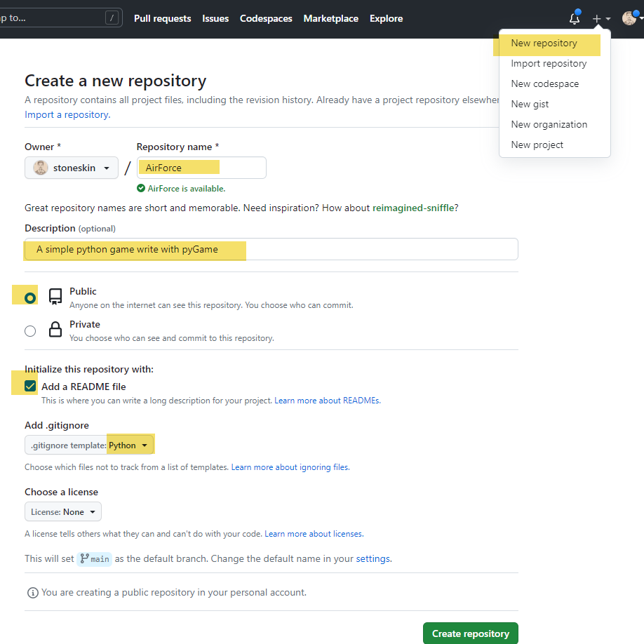

- copy the new repository url
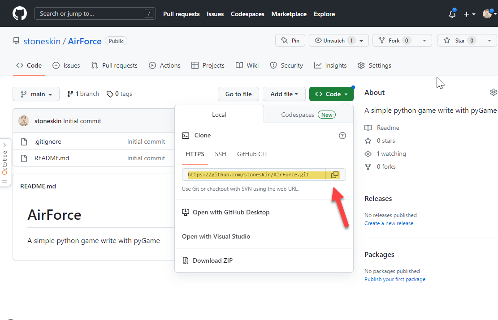

## 2. clone project repository

- clone the project with github url
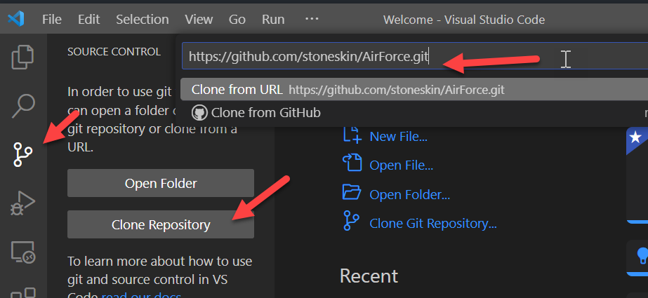
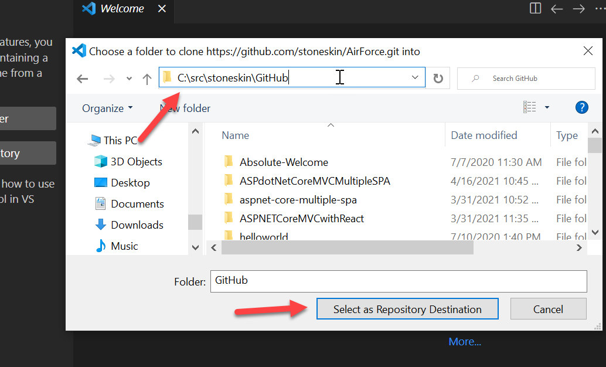

- check your new project folder
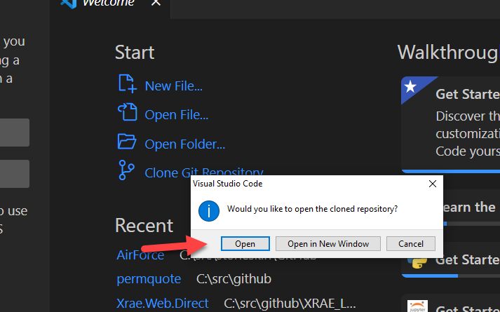
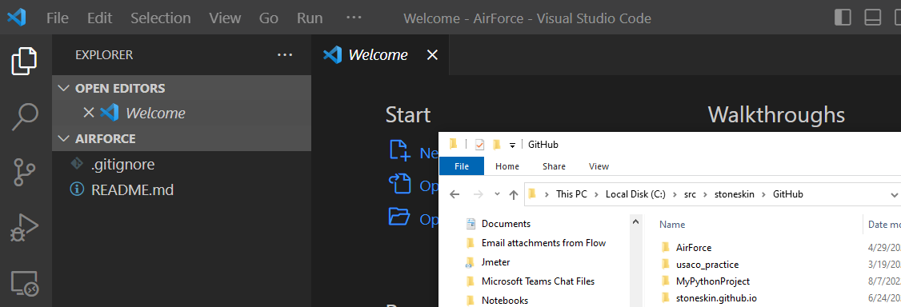
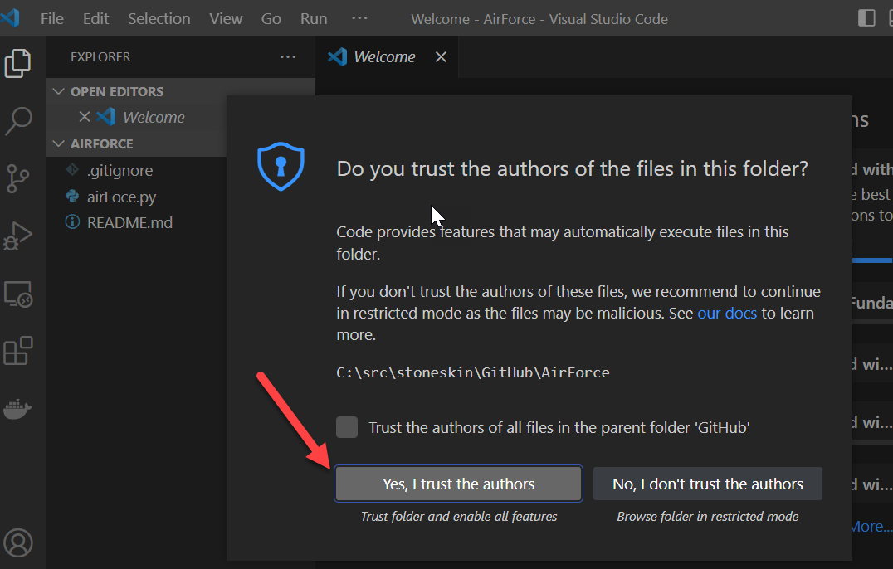

## 3. Commit your code change

- Add new files and refresh the source control pane, you will see your recently added file
- Add message and click Commit button
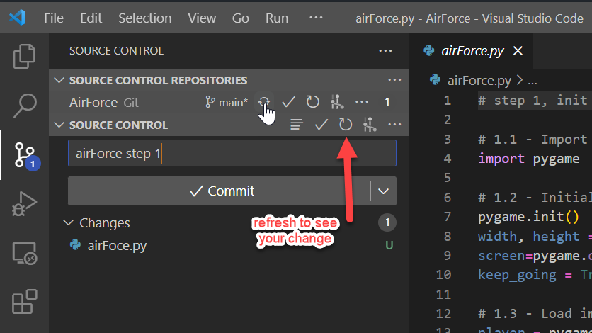

## 4 Sync your change to github

- Click the Sync Changes will need you permission of the github acct
 
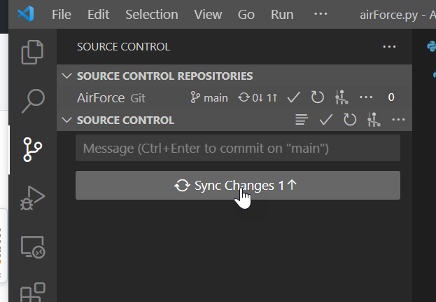
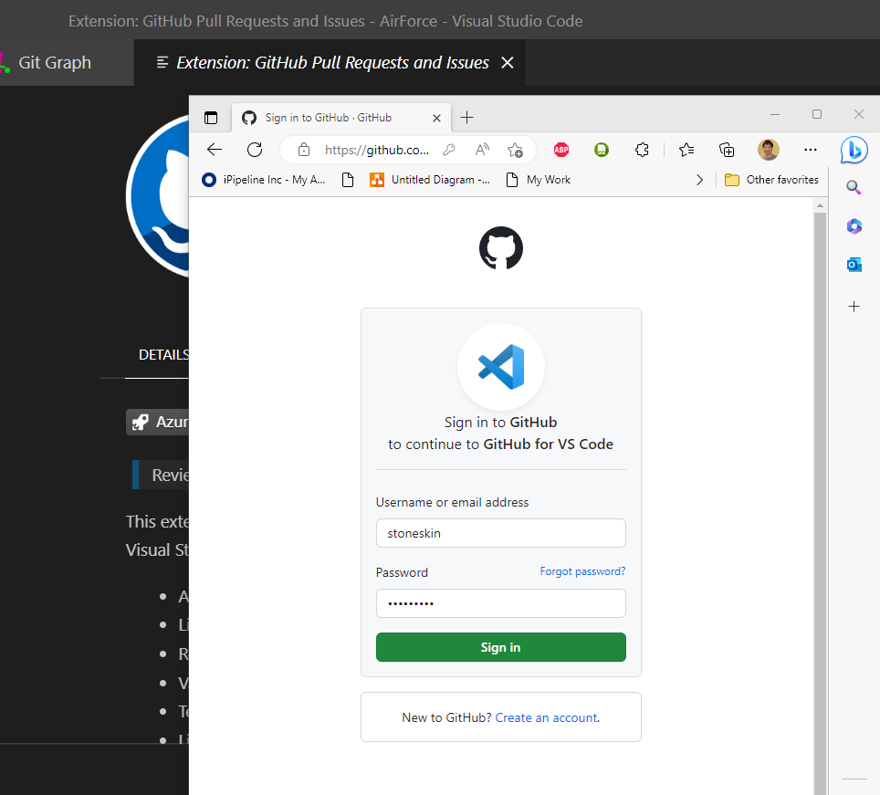

- you may have choice to sing in with your browsers
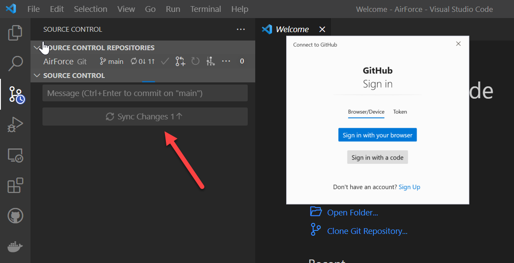

- for Window, you could search Credential Manager to see your credential of github acct
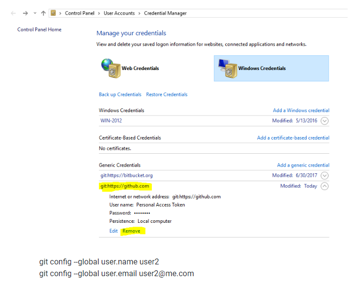

- You will see you code in github repository page
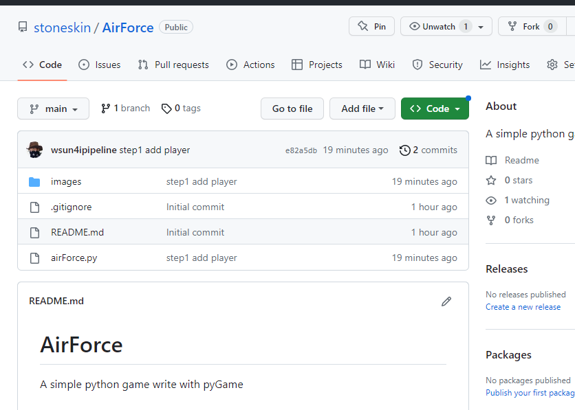

## 5 Commit more change and see change history

- You could make more change on your files, and compare the changes with previous version
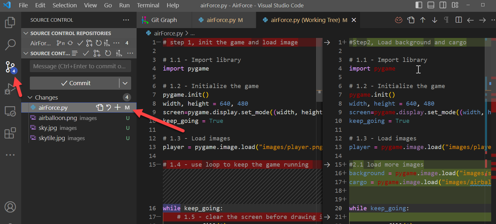
- you could install `Git Graph` extensions to see the changes tree in graph diagram
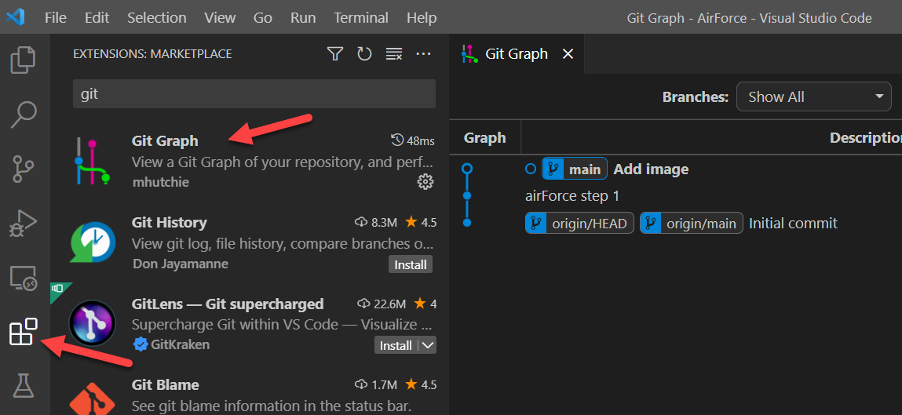

## 6 Git Extension for VSCode

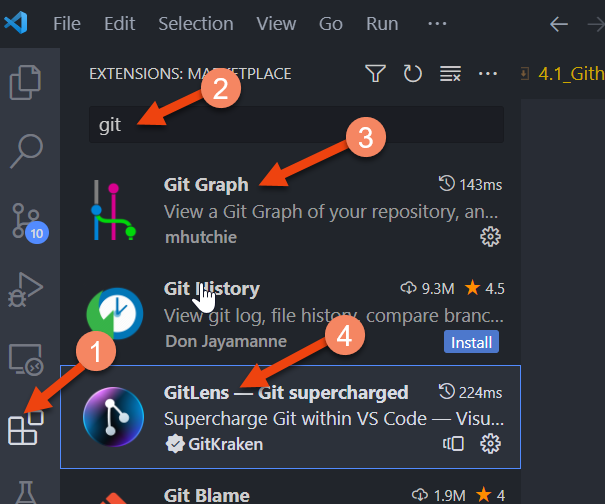
