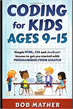
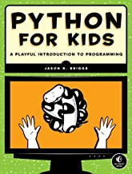
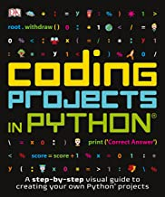
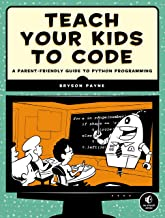
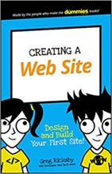

# Learn python and web development

**This class is for students of grade 6-8, who has little or no programming experience.
Students will learn Python and web programming, and learn how to completed projects and through hands-on projects on classes.**

## Requirement

 Each student need  below items for this class**

1. A Laptop or iPad with at least 4G memory with internet access.
2. Another device or screen to show the zoom meeting screen.
3. A email account, (parents please set up one for your kids, and let them keep the password)
4. A account of https://github.com/
5. Books for reference:
   >       

## Content

### Section 1: Project Planing Practice

- [Project: Plan and build your own Project with scratch](1_projectPlan/index.md)

### Section 2: Python Programming

1. Introduce ange get start with python
2. Drawing with Turtle
3. play With Number and Variables
4. Loops
5. Conditions: If-Else
6. String, Characters and Cipher Programming
7. Python Functions
8. Python Class and Object
9. Python OOP:inheritance
10. Introduce Pygame
11. Python game: TicTacToe
12. Final project

### Section 3: Version control with Github

1. Learn to use git for version control
2. User git-smart as git client
3. Using GitHub sites

### Section 4: Web Development

1. Install MSCode for Html editor
2. Build your first web page
3. Basic HTML
4. Project: build About Me web page with html
5. Basic Javascript
6. Project: Build a simple web page with javascript
   